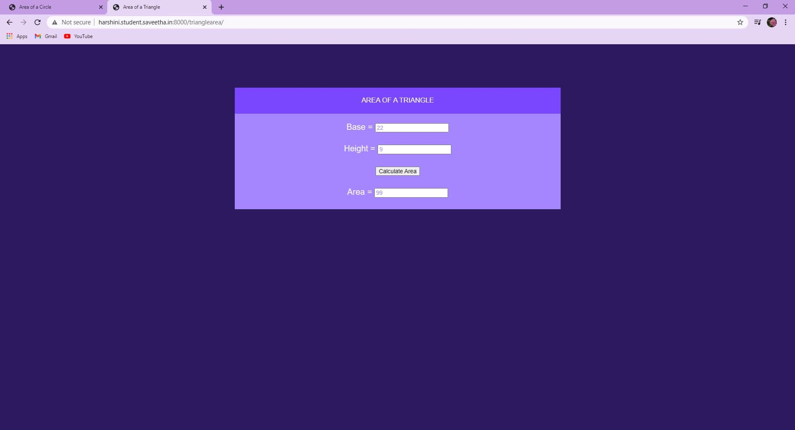
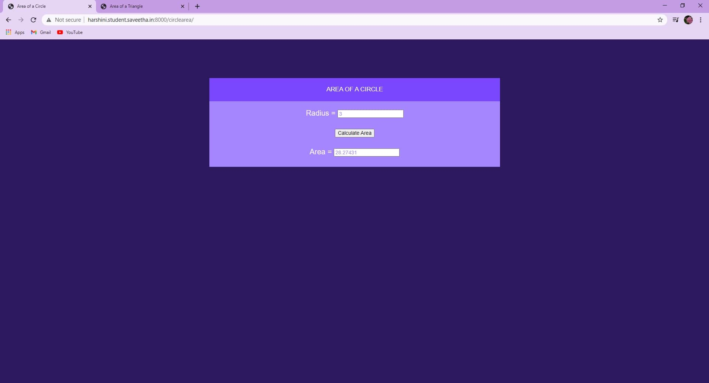

# Mathematical Calculations using JavaScript
## AIM:
To design a website to calculate the area of a circle and the area of a triangle using JavaScript.

## DESIGN STEPS:
### Step 1: 
Requirement collection.
### Step 2:
Creating the layout using HTML and CSS.
### Step 3:
Write JavaScript to perform calculations.
### Step 4:
Choose the appropriate style and color scheme.
### Step 5:
Validate the layout in various browsers.
### Step 6:
Validate the HTML code.
### Step 6:
Publish the website in the given URL.


## PROGRAM:

### trianglearea.html
```

<!DOCTYPE html>
<html>

<head>
    <title>Area of a Triangle</title>
    <link rel="stylesheet" href="">
</head>

<body>
    <div class="container">
        <div class="formview">
            <div class="banner">
                AREA OF A TRIANGLE
            </div>
            <div class="content">
                <form action="" method="GET">
                    
                    <div class="forminput">
                        <label for="value_base">Base = </label>
                        <input type="text" name="value_base" id="value_base">
                    </div>
                    <div class="forminput">
                        <label for="value_height">Height = </label>
                        <input type="text" name="value_height" id="value_height">
                    </div>
                    <div class="forminput">
                        <button type="button" name="button_multiply" id="button_multiply">Calculate Area</button>
                    </div>
                    <div class="forminput">
                        <label for="value_area">Area = </label>
                        <input type="text" name="value_area" id="value_area" readonly>
                    </div>
                </form>
            </div>
        </div>
    </div>
    <script src="/static/js/trianglearea.js"></script>
</body>

</html>
```

### trianglearea.js
```
multiplyBtn = document.querySelector('#button_multiply');

multiplyBtn.addEventListener('click',function(e){
    
    txtBase = document.querySelector('#value_base');
    txtHeight = document.querySelector('#value_height');
    txtArea = document.querySelector('#value_area');

    let d;
    
    d= (txtBase.value * txtHeight.value)/2;

    txtArea.value = d;
});
```

### circlearea.html
```

<!DOCTYPE html>
<html>

<head>
    <title>Area of a Circle</title>
    <link rel="stylesheet" href="">
</head>

<body>
    <div class="container">
        <div class="formview">
            <div class="banner">
                AREA OF A CIRCLE
            </div>
            <div class="content">
                <form action="" method="GET">
                    
                    <div class="forminput">
                        <label for="value_radius">Radius = </label>
                        <input type="text" name="value_radius" id="value_radius">
                    </div>                   
                    <div class="forminput">
                        <button type="button" name="button_area" id="button_area">Calculate Area</button>
                    </div>
                    <div class="forminput">
                        <label for="value_area">Area = </label>
                        <input type="text" name="value_area" id="value_area" readonly>
                    </div>
                </form>
            </div>
        </div>
    </div>
    <script src="/static/js/circlearea.js"></script>
</body>

</html>
```

### circlearea.js
```
areaBtn = document.querySelector('#button_area');

areaBtn.addEventListener('click',function(e){
    
    txtRadius = document.querySelector('#value_radius');
    txtArea = document.querySelector('#value_area');

    let area;
    
    area= 3.14159 * ((txtRadius.value)**2) ;

    txtArea.value = area;
});
```


## OUTPUT:





## RESULT:
Thus a website is designed to calculate the area of a triangle and the area of a circle using JavaScript and is hosted in the URL http://harshini.student.saveetha.in:8000/trianglearea/ and http://harshini.student.saveetha.in:8000/circlearea/. HTML code is validated.